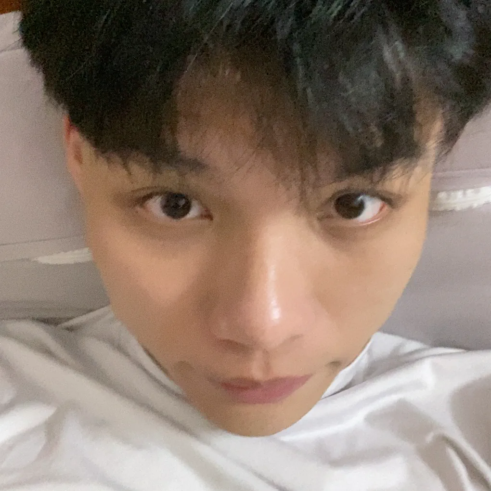
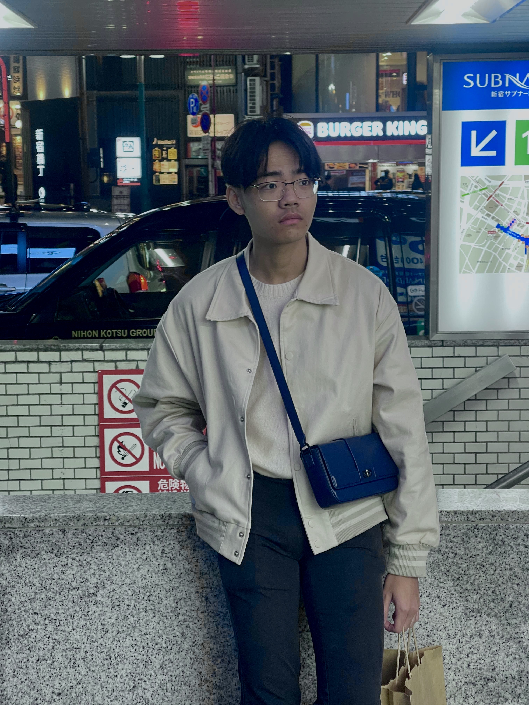

# About Us

We are a team based in the [School of Computing, National University of Singapore](http://www.comp.nus.edu.sg).

You can reach us at the email `e1399155@u.nus.edu`

## Project team

### Guo Gangquan

[[github](https://github.com/GuoGangQuan)]
[[portfolio](team/GuoGangquan.md)]

* Role: Developer
* Responsibilities: Deliverables and deadlines, UI Assistance

### Van Phuc

[[github](http://github.com/vanphuc1201)]
[[portfolio](team/vanphuc1201.md)]

* Role: Developer
* Responsibilities: Dev Ops + Threading

### Kenta Lim

[[github](http://github.com/kentalim2)] [[portfolio](team/johndoe.md)]

* Role: Developer
* Responsibilities: UI (main), Code Quality

### Tze Yan

[[github](http://github.com/tze088)]
[[portfolio](team/johndoe.md)]

* Role: Team Lead
* Responsibilities: Integration

### Neko Nguyen

[[github](http://github.com/Neko-Nguyen)]
[[portfolio](team/neko-nguyen.md)]

* Role: Developer
* Responsibilities: Code quality
