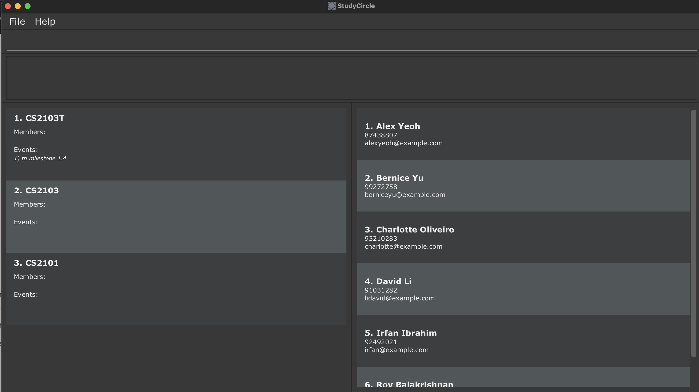
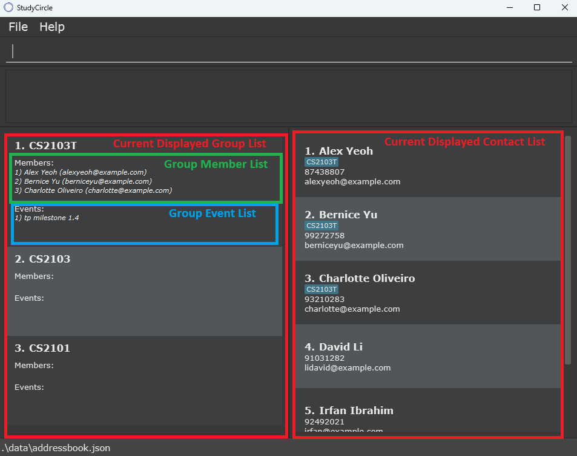

# StudyCircle User Guide

StudyCircle (SC) is a **desktop app for *NUS computing students* that helps to manage contacts in your group projects, 
sort contacts into groups and track your events within those groups, optimized for use via a Command Line Interface** (CLI) while still 
having the benefits of a Graphical User Interface (GUI). If you can type fast, SC can get your contact and 
group management tasks done faster than traditional GUI apps.

<!-- * Table of Contents -->
<page-nav-print />

--------------------------------------------------------------------------------------------------------------------

## Quick start

1. Ensure you have Java `17` or above installed in your Computer. 
   **Mac users:** Ensure you have the precise JDK version prescribed [here](https://se-education.org/guides/tutorials/javaInstallationMac.html).

1. Download the latest `.jar` file from [here](https://github.com/AY2526S1-CS2103T-F12-1/tp/releases).

1. Copy the file to the folder you want to use as the _home folder_ for your StudyCircle.

1. Open a command terminal, `cd` into the folder you put the jar file in, and use the `java -jar StudyCircle.jar` 
   command to run the application. 
   A GUI similar to the below should appear in a few seconds. Note how the app contains some sample data. 
   

1. Type the command in the command box and press Enter to execute it. e.g. typing **`help`** and pressing Enter will open the help window. 
   Some example commands you can try:

   * `list-contacts` : Lists all contacts.

   * `add-contact n/John Doe p/98765432 e/johnd@example.com` : Adds a contact named `John Doe` to the contact book.

   * `delete-contact 3` : Deletes the 3rd contact shown in the current contact list.

   * `clear` : Deletes all contacts and groups.

   * `exit` : Exits the app.

1. Refer to the [Features](#features) below for details of each command.

--------------------------------------------------------------------------------------------------------------------

## Features

<box type="info" seamless>

**Notes about the command format:** 

* Words in `UPPER_CASE` are the parameters to be supplied by the user. 
  e.g. in `add n/NAME`, `NAME` is a parameter which can be used as `add-contact n/John Doe`.

* Items in square brackets are optional. 
  e.g `n/NAME [g/GROUP_INDEX]` can be used as `n/John Doe g/1` or as `n/John Doe`.

* Items with `…`​ after them can be used multiple times including zero times. 
  e.g. `[g/GROUP_INDEX]…​` can be used as ` ` (i.e. 0 times), `g/1`, `g/2 g/3` etc.

* Parameters can be in any order. 
  e.g. if the command specifies `n/NAME p/PHONE_NUMBER`, `p/PHONE_NUMBER n/NAME` is also acceptable.

* Extraneous parameters for commands that do not take in parameters (such as `help`, `list-contacts`, 
  `exit` and `clear`) will be ignored. 
  e.g. if the command specifies `help 123`, it will be interpreted as `help`.

* If you are using a PDF version of this document, be careful when copying and pasting commands that span multiple lines as space characters surrounding line-breaks may be omitted when copied over to the application.

* All commands are case sensitive.  
  e.g. `list-contacts` is not the same as `List-Contacts`
### UI

</box>

### Viewing help : `help`

Shows a message explaining how to access the help page.

Format: `help`

## Contact related commands
### Adding a person: `add-contact`

Adds a person to the StudyCircle contact list.

Format: `add-contact n/NAME p/PHONE_NUMBER e/EMAIL [g/GROUP_INDEX]…​`

<box type="tip" seamless>

**Tip:** A person can be added to multiple groups at once by specifying multiple `g/` prefixes
</box>

Examples:
* `add-contact n/John Doe p/98765432 e/johnd@example.com`
* `add-contact n/Betsy Crowe g/1 e/betsycrowe@example.com p/1234567 g/2`

### Deleting a contact : `delete-contact`
Deletes the specified contact from the StudyCircle contact list.

Format: `delete-contact CONTACT_INDEX`

* Deletes the contact at the specified `CONTACT_INDEX`.
* The index refers to the index number shown in the displayed contact list.
* The index **must be a positive integer** 1, 2, 3, …​

Examples:

* `delete-contact 1` deletes the 1st contact in the current displayed list.

### Listing all persons : `list-contacts`

Shows a list of all contacts with their phone number, email and groups (if any) in StudyCircle.

Format: `list-contacts`

### Finding a contact : `find-contact`
Finds all persons whose names contain any of the specified keywords (case-insensitive) and displays them as a list with index numbers.

Format: `find-contact KEYWORD [MORE_KEYWORDS]…​`

* `KEYWORD` is case-insensitve  
  e.g. finding with `BOB` and `bob` will return the same result
* One or more keyword can be entered, returning all the persons which contain either of the keywords  
  e.g. `find-contact Bob Alice` will return all persons with either `Bob` or `Alice` in their names

Examples:
* `find-contact rob` will show the contact list with all people whose name contains `rob`
* `find-contact Aaron Darren` will show the contact list with all people whose name contains either `aaron` or `darren`
* `find-contact Aa Da` will match `aaron` or `darren`

## Group related commands
### Adding a group : `add-group`
Adds a new group to StudyCircle.

Format: `add-group n/GROUP_NAME`

* The group name must be unique (case-insensitive comparison).

Examples:
* `add-group n/CS2103T` adds a group with name `CS2103T` to StudyCircle
* `add-group n/Project Group A` adds a group with name `Project Group A` to StudyCircle

Listing all groups : list-groups
Shows a list of all groups with their members and events in StudyCircle.

Format: list-groups

### Deleting a group : `delete-group`
Deletes the specified group from StudyCircle.

Format: `delete-group GROUP_INDEX`

* Deletes the group at the specified `GROUP_INDEX`.
* The index refers to the index number shown in the displayed group list.
* The index **must be a positive integer** 1, 2, 3, …​

Examples:
* `delete-group 1` deletes the 1st group in the current displayed list.

### Listing all groups : `list-groups`
Shows a list of all groups with their members and events in StudyCircle.

Format: `list-groups`

### Finding a group : `find-group`
Finds all groups whose names contain any of the specified keywords (case-insensitive) and displays them as a list with 
index numbers.

Format: `find-group KEYWORD [MORE_KEYWORDS]…​`

* `KEYWORD` is case-insensitve  
  e.g. finding with `tp` and `TP` will return the same result
* One or more keyword can be entered, returning all the groups which contain either of the keywords  
  e.g. `find-group tp CS2101` will return all groups with either `tp` or `CS2101` in their names

Examples:
* `find-group CA2` will show the group list with all groups whose name contains `CA2`
* `find-group CS 210` will show the group list with all groups whose name contains either `CS` or `210`
* `find-group ab3 2101` will match groups named `AB3` or `cs2101`

### Adding a member to a group : `add-member`
Adds the specified contacts to the specified group.

Format: `add-member g/GROUP_INDEX c/CONTACT_INDEX [c/CONTACT_INDEX]…​`

* Both `GROUP_INDEX` and `CONTACT_INDEXES` **must be positive integers** 1, 2, 3, …​
* `CONTACT_INDEXES` can be one or multiple contact indexes
* `CONTACT_INDEXES` are taken from the currently displayed contact list
* To input more than one index, separate each index with a new prefix c/
  e.g. `c/1` or `c/1 c/2 c/3`

Examples:
* `add-member g/1 c/2` adds the 2nd contact to the 1st group.
* `add-member g/1 c/1 c/2` adds the 1st and 2nd contact to the 1st group

### Deleting a member from a group : `delete-member`
Deletes the specified contacts from the specified group.

Format: `delete-member g/GROUP_INDEX c/CONTACT_INDEX [c/CONTACT_INDEX]…​`

* Both `GROUP_INDEX` and `CONTACT_INDEX` **must be positive integers** 1, 2, 3, …​
* `CONTACT_INDEX` can be one or multiple contact indexes
* `CONTACT_INDEX` are taken from the currently displayed contact list
* To input more than one index, separate each index with a new prefix c/
  e.g. `c/1` or `c/1 c/2 c/3`

Examples:
* `delete-member g/1 c/2` deletes the 2nd contact from the 1st group.
* `delete-member g/1 c/1 c/2` deletes the 1st and 2nd contacts from the 1st group

### Adding an event to a group : `add-event`
Adds an event to the specified group.

Format: `add-event GROUP_INDEX d/DESCRIPTION`

* The index **must be a positive integer** 1, 2, 3, …​

Examples:
* `add-event 1 d/MVP Feature Specifications` adds the event `MVP FeatureSpecifications` to the 1st group

### Clearing the StudyCircle contact book : `clear`
Clears the contact book of all groups and persons.

Format: `clear`

### Exiting the program : `exit`
Exits the program.

Format: `exit`

### Saving the data

StudyCircle data is saved in the hard disk automatically after any command that changes the data. There is no need to 
save manually.

### Editing the data file

StudyCircle data is saved automatically as a JSON file `[JAR file location]/data/addressbook.json`. Advanced users are 
welcome to update data directly by editing that data file.

<box type="warning" seamless>

**Caution:**
If your changes to the data file makes its format invalid, StudyCircle will discard all data and start with an empty 
data file at the next run.  Hence, it is recommended to take a backup of the file before editing it. 
Furthermore, certain edits can cause StudyCIrcle to behave in unexpected ways (e.g., if a value entered is outside the 
acceptable range). Therefore, edit the data file only if you are confident that you can update it correctly.
</box>

### Linking and redirecting to GitHub Repo / Canvas course website `[coming in v0.1.4]`

_Details coming soon ..._

--------------------------------------------------------------------------------------------------------------------

## FAQ

**Q**: How do I transfer my data to another Computer? 
**A**: Install the app in the other computer and overwrite the empty data file it creates with the file that 
contains the data of your previous StudyCircle home folder.

--------------------------------------------------------------------------------------------------------------------

## Known issues
 **can someone test this im not sure if its still an issue**
1. **When using multiple screens**, if you move the application to a secondary screen, and later switch to using only the primary screen, the GUI will open off-screen. The remedy is to delete the `preferences.json` file created by the application before running the application again.
2. **When minimizing the window of StudyCircle**, if the window gets too small and the description of a group's 
   event or member name is too long, it will cause the box displaying that group to stop automatically resizing. 
   This leads to the need to use a scroll bar to scroll through that group's events/members if there are too many 
   items in either category.

--------------------------------------------------------------------------------------------------------------------

## Command summary

Action                | Format, Examples
----------------------|----------------------------------------------------------------------------------------------------------------------------------------------------------------------
**Add contact**       | `add-contact n/NAME p/PHONE_NUMBER e/EMAIL [g/GROUP_INDEX]…​`   e.g., `add n/James Ho p/22224444 e/jamesho@example.com g/1 g/2`
**Delete contact**    | `delete-contact CONTACT_INDEX`  e.g., `delete-contact 3`
**Find contact**      | `find-contact KEYWORD [MORE_KEYWORDS]…​`  e.g., `find-contact James Jake`
**List contacts**     | `list-contacts`
**Add group**       | `add-group n/NAME`   e.g., `add n/2103T`
**Delete group**    | `delete-group GROUP_INDEX`  e.g., `delete-group 3`
**Find group**      | `find-group KEYWORD [MORE_KEYWORDS]…​`  e.g., `find-group CA1 CA2`
**List groups**     | `list-groups`
**Add members to a group**       | `add-member g/GROUP_INDEX c/CONTACT_INDEX [c/CONTACT_INDEX]…​`   e.g., `add-member g/1 c/1`, `add-member g/1 c/1 c/2`
**Delete members from a group**  | `delete-member g/GROUP_INDEX c/CONTACT_INDEX [c/CONTACT_INDEX]…​`   e.g., `delete-member g/1 c/1`, `delete-member g/1 c/1 c/2`
**Add an event to a group**     | `add-event GROUP_INDEX d/DESCRIPTION`  e.g., `add-event 2 d/do project work`
**Clear StudyCircle contacts and groups**| `clear`
**Help**              | `help`
